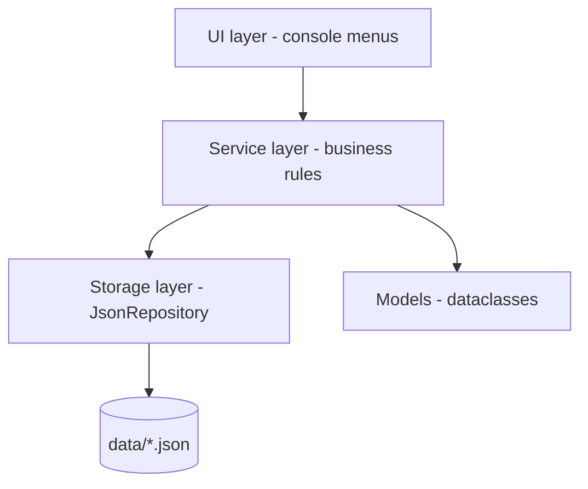

# JO_PHONE

```
=================================================
              JO_PHONE
      Mobile Shop Management System
=================================================
Manage Customers, Hardware, Tariffs,
Contracts and Sales

Version 1.0
Developed for WIB22-440
=================================================
```

**JO_PHONE** ("JO" for Jordan + "PHONE" for mobile phone shop) is a console-based
management system for a mobile phone shop in Jordan. It manages **customers**,
**hardware** (smartphones & accessories), **tariffs** (mobile plans),
**contracts** and **sales**, and provides business **reports**.

University programming project for **WIB22-440**.

---

## Quick Start

Requirements: **Python 3.10+** — no third-party packages needed
(standard library only).

```bash
# start the application
python main.py

# reset the data files with fresh sample data
python main.py --seed

# run the test suite (25 tests)
python -m unittest discover
```

The repository ships with a ready-to-use sample data set in `data/`.
If the data files are missing, the application recreates them
automatically on first start.

---

## Features

### Customers
- List, search (name / e-mail / city), view details (incl. contracts & purchases)
- Add / edit / delete with validation
  - Jordanian mobile number format (`07XXXXXXXX` or `+9627XXXXXXXX`)
  - E-mail format validation and uniqueness check
- A customer with **active contracts cannot be deleted** (business rule)

### Hardware (Inventory)
- Smartphones and accessories with brand, price (JOD) and stock
- Add / edit / delete / restock / search
- Low-stock overview (threshold: 5 units)
- Hardware referenced by sales or contracts **cannot be deleted**
  (history stays consistent)

### Tariffs (Mobile Plans)
- Monthly fee, data volume, included minutes (`-1` = unlimited),
  minimum contract duration
- Unique tariff names; tariffs used by contracts cannot be deleted

### Contracts
- Link a customer to a tariff, optionally bundling a device
- Bundling a device takes one unit out of stock automatically
- Contract duration must satisfy the tariff's minimum duration
- Monthly fee and device price are **snapshotted** at signing, so later
  price changes never alter existing contracts
- Terminate contracts (status `ACTIVE` / `TERMINATED`), computed end date

### Sales
- Record direct hardware sales (customer, hardware, quantity, date)
- Stock is reduced automatically; **overselling is blocked**
- Unit price is snapshotted at sale time

### Reports
1. **Inventory & low-stock report** – stock, stock value, low-stock alerts
2. **Sales summary** – total revenue, revenue by hardware & by month, best seller
3. **Contracts & recurring revenue** – active contracts per tariff,
   monthly recurring revenue (MRR), committed contract value
4. **Customer overview** – purchases + contract value per customer,
   sorted by total customer value

---

## Project Structure

```
jo_phone/
├── main.py                  # entry point (python main.py [--seed])
├── data/                    # JSON persistence (one file per entity)
│   ├── customers.json
│   ├── hardware.json
│   ├── tariffs.json
│   ├── contracts.json
│   └── sales.json
├── src/
│   ├── app_context.py       # dependency wiring (repos + services)
│   ├── sample_data.py       # sample data generator (--seed)
│   ├── models/              # plain dataclasses (Customer, Hardware, ...)
│   ├── storage/             # generic JSON file repository
│   ├── services/            # business logic + validation per entity
│   ├── ui/                  # console menus and I/O helpers
│   └── utils/               # validators and domain exceptions
└── tests/                   # unittest suite (validators, services, reports)
```

### Architecture (layered)



- **UI layer** (`src/ui/`): one menu class per entity plus shared
  `console_io` helpers (validated input loops, table rendering, generic
  menu loop). The UI never touches files directly.
- **Service layer** (`src/services/`): all business rules and
  validation. Services raise typed exceptions (`ValidationError`,
  `NotFoundError`, `BusinessRuleError`) that the menu loop catches and
  displays — the app never crashes on bad input.
- **Storage layer** (`src/storage/`): a single generic `JsonRepository`
  handles loading/saving any entity. Every mutation is written to disk
  immediately, so no explicit "save" step exists.
- **Models** (`src/models/`): plain dataclasses with
  `to_dict`/`from_dict` for JSON (de)serialization.

---

## Key Design Decisions

| Decision | Rationale |
|---|---|
| JSON files (one per entity) | Human-readable, diff-friendly, no DB setup needed for a university project |
| Generic `JsonRepository` | One tested persistence implementation instead of five copies; easy to swap for a DB later |
| Save on every mutation | Data survives any way the program exits; no "forgot to save" bugs |
| Price snapshots on contracts/sales | Historical records must not change when catalog prices change |
| Typed domain exceptions | One `except AppError` in the menu loop handles all expected failures gracefully |
| Auto-increment integer IDs | Simple, predictable, easy to type into a console menu |
| Sample data built via services | Seeding runs through the real business rules, so shipped data is guaranteed consistent (e.g. stock levels) |
| Standard library only | Zero-setup grading/demo: `python main.py` just works |

---

## Sample Data

`python main.py --seed` (re)creates a realistic demo data set:

- **8 customers** from Jordanian cities (Amman, Irbid, Zarqa, Aqaba, Salt, Madaba)
- **10 hardware items** (5 smartphones, 5 accessories), prices in JOD
- **5 tariffs**: JO Basic, JO Smart, JO Plus, JO Max, JO Youth
- **8 contracts** (5 with bundled devices, 1 terminated for demo purposes)
- **12 sales** spread over Jan–Jun 2026

> Note: `--seed` **overwrites** the current data files.

---

## Testing

```bash
python -m unittest discover          # run all 25 tests
python -m unittest tests.test_services -v
```

Coverage includes: input validators, CRUD + persistence round-trips,
business rules (overselling blocked, delete protection, minimum contract
duration, double termination), price snapshots, all four reports, and
sample data consistency.

---

## License & Authors

Developed by **zzaaid03** for the WIB22-440 university course.
